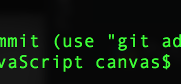
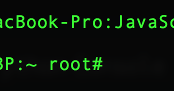

# 1. linux简介

## 1. shell

当我们说的命令行时，我们实际上指的是shell。shell是一个接受由键盘输入的命令,并将其传递给操作系统来执行的程序。几乎所有的Linux发行版都提供shell程序,改程序来自于称之为bash的GNU项目。bash是Bourne Again Shell的首字母缩写。即是sh的增强版本,sh是最初的unix shell程序。

## 2. 终端仿真器

当使用图形用户界面时,需要另一种叫做终端仿真器\(terminal\)的程序与shell交互。在linux下面有很多不同的终端给你选择使用。

## 3. 在终端的第一次输入

1. 开打终端,mac,linux都有不同终端。
2. 如何在终端中简单查看是普通用户还是超级用户
   1. 在终端中看到的是 $表示 普通用户执行命令

      

   2. 在终端中看到的是 \#表示 超级用户权限正在执行命令

       

## 4. history

1. 在终端中输入history来查看命令历史记录

> 大部分Linux发行版会记录500条命令\(最近的\)

```text
$ history
```

1. 我们也可以使用上下键来获取历史记录
2. 我们可以使用! 来获取历史命令
   1. !+num 使用! 加上history里面的命令号码,就可以快捷的打出命令来
   2. !his 他会自动补全上一次的命令,就像正则匹配一样,比如这个命令就会补全我们刚才输入的history命令

## 5. date cal 查看日期函数

1. 使用date来查看日期

   ```text
    $ date
   ```

2. 使用cal来获取日历

   ```text
    $ cal
   ```

## 6. exit 结束会话

1. exit在本地输入会退出终端程序
2. exit在ssh登录中会退出远程ssh,但是不会退出程序

## 7. 目录导航 pwd cd ls

1. 文件目录树

   和其他系统一样,linux系统的也是通过文件夹将目录进行一个层次的划分,文件夹有一个最顶层的目录,叫做根目录。他包含了文件和文件夹,然后这些文件夹再包含子文件和文件夹依次类推。这种结构我们称为文件系统树

   > 在linux中,不管你有多少个存储设备,通常只有一个文件系统树。

   文件的根目录用 / 表示

   在linux中我们可以使用

   ```text
    $ tree /
   ```

   来查看 / 目录的下面的结构

2. pwd 查看当前工作\(所在\)目录

   ```text
    $ pwd
   ```

3. ls 列出当前工作目录和文件和目录

   ```text
    $ ls
   ```

4. 更改当前工作目录
   1. cd 命令：就像我们windows一样,我们也可以在linux里面去切换所在的文件夹,cd 后面跟上目录的名称就可以直接切换到某个目录

      ```text
       $ cd /Users/canvas/Desktop/project/web_font_notes
      ```

   2. 绝对路径: 上述所使用的方式是使用了绝对路径,绝对路径是指从根目录开始 以 `/` 号为目录的层级分割,一层层的到达所指的目录。 比如上面所说的:

      ```text
      /Users/canvas/Desktop/project/web_font_notes
      ```

   3. 相对路径: 既然有绝对路径,那么就有相对路径,就是相对本工作目录的其他目录所在的位置,比如找到本目录所属的上级`../`目录或者目录下面的某个目录`./`
5. 快捷命令

   ```text
    回到刚才所在的目录
    cd -
    到用户的根目录下面
    cd ~
    到xx用户的根目录下面
    cd ~username
   ```

6. linux用户目录

   我们知道 linux的根目录是 `/`,linux是一个多用户的系统,每一个用户都有自己的独立的空间, `~`代表进入到本用户独立的空间中\(根目录\),一般 Linux的用户空间是存在于 `/home/`下面的

7. 更多的ls扩展命令
   1. ls 可以直接显示本文件下面的文件

      ```text
       canvasdeMBP:web_font_notes canvas$ ls
       06_js_anwser.html        class_question_and_anwser    home_work_and_anwser
      ```

   2. ls 后面跟上文件路径可以查看那个文件夹中的子文件

      ```text
       canvasdeMBP:web_font_notes canvas$ ls ./css/

       css_basic    css_cases    css_layout    test
      ```

   3. 可以使用长格式来获取更多的细节\(相当于扩展的命令\)

      ```text
       canvasdeMBP:web_font_notes canvas$ ls -l

       -rw-r--r--   1 canvas  staff  2308  8 27 16:29 06_js_anwser.html
      -rw-r--r--@  1 canvas  staff  4305  9 13 21:17 README.md
      drwxr-xr-x   2 canvas  staff    64  9  3 18:37 bootstrap
      ```

## 8. 命令的选项和参数

大部分命令是可以通过参数来使命令有不同的效果的,大致的命令格式如下:

```text
command -options arguments
```

就像上面的命令一样 加上命令的选项

```text
canvasdeMBP:web_font_notes canvas$ ls -lt
total 40
-rw-r--r--@  1 canvas  staff  4305  9 13 21:17 README.md
drwxr-xr-x  10 canvas  staff   320  9 13 21:14 jquery
drwxr-xr-x   8 canvas  staff   256  9 13 16:56 js
drwxr-xr-x   6 canvas  staff   192  9 13 08:58 css
drwxr-xr-x   3 canvas  staff    96  9  9 22:10 sources
```

`t`表示以时间顺序来查看子文件,`lt`是`-l` 和`-t`的联合使用,表示以长格式输出,并且以时间来排序

也可以使用长格式来输出

```text
canvasdeMBP:web_font_notes canvas$ ls -lt -reverse

 8 -rw-r--r--   1 canvas  staff  2308  8 27 16:29 06_js_anwser.html
 0 drwxr-xr-x   2 canvas  staff    64  9  3 18:37 bootstrap
 0 drwxr-xr-x   5 canvas  staff   160  9  5 14:42 pics
 0 drwxr-xr-x   4 canvas  staff   128  9  5 14:46 class_question_and_anwser
```

长格式中 `-reverse`是长格式的写法,就像 `-l`也可以写`-long`的方式表达

所以说 命令可以使用长格式或者短格式来输出,有些版本的linux可能需要 `--long`来表示长格式

## 9. ls命令显示的解释

当输入 `ls -l` 之后,会显示如下

```text
canvasdeMBP:web_font_notes canvas$ ls -lt -reverse

 8 -rw-r--r--   1 canvas  staff  2308  8 27 16:29 06_js_anwser.html
 0 drwxr-xr-x   2 canvas  staff    64  9  3 18:37 bootstrap
 0 drwxr-xr-x   5 canvas  staff   160  9  5 14:42 pics
 0 drwxr-xr-x   4 canvas  staff   128  9  5 14:46 class_question_and_anwser
```

| 字段 | 含义 |
| :--- | :--- |
| -rw-r--r-- | 第一个字符 -表示文件 如果是d表示文件夹 后面的rw等等表示的是本用户,用户组,其他用户对这个文件或者文件夹的使用权限 |
| 1 | 文件硬链接数目 |
| canvas | 文件所有者 |
| staff | 文件所属用户组 |
| 2308 | 以字节数显示文件大小 |
| 18:37 | 文件的上次修改时间 |
| pics | 文件的名称 |

ls命令含义总结:

| 参数 | 描述 |
| :--- | :--- |
| -a | –all 列出目录下的所有文件，包括以 . 开头的隐含文件 |
| -l | 除了文件名之外，还将文件的权限、所有者、文件大小等信息详细列出来 |
| -d | –directory 将目录象文件一样显示，而不是显示其下的文件 |
| -h | –human-readable 以容易理解的格式列出文件大小 \(例如 1K 234M 2G\) |
| -t | 以文件修改时间排序 |

## 10. file用法

在探索linux系统的时候,知道文件的类型是很有用的,我们在windows上面一般是通过查看文件名的后缀来知晓文件的类型的`meinv.jpg`, 但是在linux上面,文件的名字和文件本身的类型并不挂钩,所以不管是什么类型的文件我们都可以随便的起名字。但是我们可以通过file这个命令来查看文件的类型

```text
canvasdeMBP:bin canvas$ file lzma
lzma: Mach-O 64-bit executable x86_64
```

通过上面我们可以看到,文件的类型是可执行的64位程序

## 11. less命令的使用

less命令可以帮我们查看文件里面的内容

我们可以直接去less一个文件

```text
less lzcmp
```

当我们less的时候,使用 j向下翻 k向上翻 q退出 这和vim编辑器有点类似

## 12. linux 默认目录说明

1. `/` 系统根目录
2. `/bin` 包含系统启动和运行所需要的二进制文件\(binary\)
3. `/dev` 设备节点特殊目录。内核将它能够识别的所有设备存放在这个目录\(linux一切皆文件 设备也要看成文件\)
4. `/etc` 一般的配置文件都在里面
5. `/home` 由于Linux是多用户的 所以每个用户都有自己独立空间,普通的用户只有权限在这里创建文件。
6. `lib`  linux 核心系统使用的共享库文件
7. `/lost+found` 当系统崩溃时,该目录用于恢复分区。\(严重的问题\) 
8. `/media` 可移除媒体设备挂载点。比如usb驱动 cd-rom等。当设备插入计算机后,会自动的挂载到这个目录节点下面
9. `/mnt` 早期linux系统中 /mnt 目录包含手动挂载可移除的设备挂载点
10. `/opt` 安装可选软件,一般用户自己下载的软件放在这里
11. `/root`root账户的主目录
12. `/sbin` 系统二进制文件。重要的系统文件。为超级用户预留的 
13. `/tmp` 提供用户存放各种临时系统文件的目录 可以配置每次重启系统时清空这个目录
14. `/usr` 包含普通用户使用的所有程序和相关文件
15. `/usr/bin` 目录中放置了一些Linux发行版安装的可以执行程序。存储成千上万个程序
16. `/usr/lib`  /usr/bin中使用的共享库
17. `/usr/local` 由源代码编译好的程序通常安装在/usr/local/bin中
18. `/usr/sbin` 更多的管理员程序
19. `/var` 存放有可能改变的目录，比如说系统日志  

